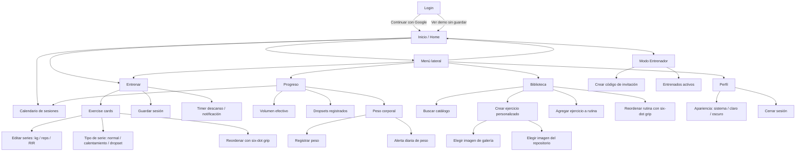

# Agujetas Flutter UI Navigation Map

Este documento describe la estructura navegable de la app Flutter. Debe usarse como contrato de producto para revisar si una pantalla, tarjeta o botón clicable lleva a un destino claro.

## Mapa General

## Pantallas Principales

| Pantalla | Entrada | Acciones principales | Destino esperado |
| --- | --- | --- | --- |
| Login | App sin usuario autenticado | Continuar con Google | Inicio autenticado |
| Login | App sin usuario autenticado | Ver demo sin guardar | Inicio con `DemoAgujetasRepository` |
| Inicio | Bottom nav, login, menú lateral | Iniciar entrenamiento | Entrenar |
| Inicio | Card calendario | Ver calendario de sesiones | Bottom sheet de calendario |
| Inicio | Modo de uso | Cambiar Normal / Entrenador | Inicio en modo elegido |
| Entrenar | Bottom nav, CTA inicio, menú lateral | Editar kg / reps / RIR | Misma pantalla, estado actualizado |
| Entrenar | Grip six dots | Reordenar ejercicios | Misma pantalla, orden actualizado |
| Entrenar | Menú mover | Mover arriba / abajo | Misma pantalla, orden actualizado |
| Entrenar | Guardar | Persistir sesión | Firestore `sessions` y snackbar |
| Entrenar | Timer descanso | Programar alerta | Notificación local |
| Progreso | Bottom nav, menú lateral | Registrar peso | Bottom sheet de peso |
| Progreso | Alertarme cada mañana | Programar alerta diaria | Notificación local diaria |
| Progreso | Calendario | Ver calendario de sesiones | Bottom sheet de calendario |
| Biblioteca | Bottom nav, menú lateral | Buscar catálogo | Lista filtrada |
| Biblioteca | Crear ejercicio personalizado | Formulario de ejercicio | Nuevo ejercicio en rutina y Firestore |
| Biblioteca | Elegir imagen de galería | Selector nativo | `imageUri` local asociado |
| Biblioteca | Elegir imagen del repositorio | Selector interno | `agujetas-image://...` asociado |
| Biblioteca | Agregar ejercicio | Agregar a rutina activa | Entrenamiento actual actualizado |
| Biblioteca | Grip six dots | Reordenar rutina | Misma pantalla, orden actualizado |
| Perfil | Bottom nav, menú lateral | Cambiar tema | ThemeMode actualizado |
| Perfil | Cerrar sesión | Sign out | Login |
| Panel entrenador | Inicio en modo entrenador | Crear código | Firestore `trainerInvites` |
| Panel entrenador | Inicio en modo entrenador | Ver entrenados activos | Lista desde `trainerClientLinks` |

## Reglas De Interaccion

- El grip six dots es el único punto que debe iniciar drag and drop.
- Tocar la tarjeta debe abrir, editar o ejecutar la acción principal; no debe competir con el gesto de arrastre.
- El drag debe iniciar de forma inmediata desde el handle, sin long-press perceptible.
- El área táctil mínima del handle debe ser 44 x 44 px.
- Todo reorder debe tener alternativa accesible: mover arriba y mover abajo.
- Cada tarjeta clicable debe tener feedback visual y destino claro.
- Las transiciones deben ser cortas, reversibles y no bloquear el flujo de entrenamiento.

## Pendientes UX

- Validar drag and drop en Android real con grabación de pantalla, no solo con screenshot.
- Definir detalle de ejercicio como pantalla propia si el usuario necesita historial por ejercicio.
- Decidir si el calendario debe pasar de bottom sheet a pantalla completa cuando haya schedules reales.
- Agregar rutas declarativas si la app crece más allá de cinco tabs y modales.
