# Agujetas Flutter UI Navigation Map

Este documento describe la estructura navegable de la app Flutter. Debe usarse como contrato de producto para revisar si una pantalla, tarjeta o botón clicable lleva a un destino claro.

## Mapa General

```mermaid
flowchart TD
  A["Login"] -->|Continuar con Google sin consentimiento| A2["Consentimiento de privacidad"]
  A2 -->|Aceptar términos y datos| B["Inicio"]
  A2 -->|Cerrar sesión| A
  A -->|Continuar con Google con consentimiento| B
  A -->|Ver demo sin guardar| B

  B["Inicio / Home"] --> M["Modo de cuenta"]
  M -->|Free: Modo usuario| B
  M -->|Free: Modo entrenador bloqueado| U["Popup upgrade Pro"]
  U -->|Ahora no| B
  U -->|Ver planes / Activar Pro demo| E["Panel entrenador"]
  M -->|Pro: Modo usuario| B
  M -->|Pro: Modo entrenador| E

  B --> S["Selector de sesión"]
  S -->|Fuerza| C["Entrenar · Fuerza"]
  S -->|Hipertrofia| C2["Entrenar · Hipertrofia"]
  S -->|Técnica| C3["Entrenar · Técnica"]
  S -->|Libre| C4["Entrenar · Libre"]
  B --> D["Calendario mensual"]
  B --> F["Bottom nav fija"]
  B --> X["Dropdown contextual por pantalla"]

  F --> B
  F --> C
  F --> G["Progreso"]
  F --> H["Biblioteca"]
  F --> I["Perfil"]
  X --> X1["Submenú distinto según tab"]

  C["Entrenar"] --> C1["Exercise cards"]
  C2 --> C1
  C3 --> C1
  C4 --> C1
  C1 --> C5["Editar series: kg / reps / RIR"]
  C1 --> C6["Tipo de serie: normal / calentamiento / dropset"]
  C1 --> C7["Reordenar con six-dot grip"]
  C1 --> C10["Detalle de ejercicio e historial local"]
  C10 --> C11["Usar último registro como defaults"]
  C --> C8["Guardar sesión"]
  C --> C9["Timer descanso / notificación"]

  G["Progreso"] --> G1["Volumen efectivo"]
  G --> G2["Dropsets registrados"]
  G --> G3["Peso corporal"]
  G --> G6["Comparación semana previa"]
  G --> G7["Ejercicio dominante semanal"]
  G3 --> G4["Registrar peso"]
  G3 --> G5["Alerta diaria de peso"]
  G3 --> G8["Historial y tendencia local"]
  G --> D

  D["Calendario mensual"] --> D1["Mes anterior / siguiente / hoy"]
  D --> D2["Día con sesiones"]
  D2 --> D3["Detalle de sesión histórica"]
  D3 --> D4["Ejercicios, series, kg, reps, RIR y segmentos"]
  D3 --> D5["Repetir sesión como entrenamiento activo"]
  D3 --> D6["Guardar sesión como rutina local"]
  D3 --> D7["Editar nombre / nota"]
  D3 --> D8["Borrar sesión local"]

  H["Biblioteca"] --> H1["Buscar catálogo"]
  H --> H2["Crear ejercicio personalizado"]
  H2 --> H3["Elegir imagen de galería"]
  H2 --> H4["Elegir imagen del repositorio"]
  H --> H5["Agregar ejercicio a rutina"]
  H --> H6["Reordenar rutina con six-dot grip"]
  H --> H7["Nueva rutina local"]
  H7 --> H8["Agregar desde catálogo"]
  H7 --> H9["Guardar cambios"]

  I["Perfil"] --> I1["Apariencia: sistema / claro / oscuro"]
  I --> I2["Exportar respaldo local JSON"]
  I --> I3["Importar respaldo local JSON"]
  I --> I4["Importar datos legacy incluidos"]
  I --> I5["Cerrar sesión"]
  I --> I6["Plan y suscripción"]
  I6 --> I7["Planes Agujetas Free / Pro"]

  E["Panel entrenador"] --> E1["Crear código de invitación"]
  E --> E2["Entrenados activos"]
  E2 --> E4["Asignar rutina existente"]
  E4 --> E5["Firestore assignedRoutines"]
  E2 --> E6["Enviar tarea"]
  E6 --> E7["Firestore tasks"]
  E2 --> E8["Agendar sesión"]
  E8 --> E9["Firestore schedules"]
  E2 --> E10["Asignar meta"]
  E10 --> E11["Firestore goals"]
  E --> E3["Metas y tareas"]
  B --> B2["Rutinas asignadas por entrenador"]
  B --> B3["Tareas del entrenador"]
  B --> B4["Schedules asignados"]
  B --> B5["Metas del entrenador"]
  B --> B6["Actividad de asignaciones"]
```

## Pantallas Principales

| Pantalla | Entrada | Acciones principales | Destino esperado |
| --- | --- | --- | --- |
| Login | App sin usuario autenticado | Continuar con Google | Inicio autenticado |
| Login | App sin usuario autenticado | Ver demo sin guardar | Inicio con `DemoAgujetasRepository` |
| Consentimiento | Usuario autenticado sin aceptación vigente | Aceptar y continuar | Guardar consentimiento local versionado y entrar a Inicio |
| Consentimiento | Usuario autenticado sin aceptación vigente | Cerrar sesión | Login |
| Inicio | Login, bottom nav | Cambiar a Modo usuario | Inicio normal |
| Inicio | Usuario Free | Tocar Modo entrenador | Popup de upgrade Pro |
| Inicio | Usuario Pro | Tocar Modo entrenador | Panel entrenador |
| Inicio | Usuario vinculado | Rutinas asignadas | Lista desde Firestore `assignedRoutines` |
| Inicio | Usuario vinculado | Tareas del entrenador | Lista desde Firestore `tasks` |
| Inicio | Tarea asignada | Revisar | Hoja de accion con descripcion, vencimiento, comentario y completar |
| Inicio | Tarea asignada | Marcar como completada | Actualizar `tasks/{id}.status = completed` y `completionNote` |
| Inicio | Usuario vinculado | Schedules asignados | Lista desde Firestore `schedules` |
| Inicio | Schedule asignado | Gestionar | Hoja de accion con estado, nota, cancelar o reprogramar |
| Inicio | Schedule asignado | Cancelar schedule | Actualizar `schedules/{id}.status = cancelled` |
| Inicio | Schedule asignado | Reprogramar | Actualizar `schedules/{id}.scheduledFor` y mantener `status = scheduled` |
| Inicio | Usuario vinculado | Metas del entrenador | Lista desde Firestore `goals` con progreso |
| Inicio | Meta asignada | Actualizar | Dialog con valor manual de progreso |
| Inicio | Meta asignada | Guardar valor | Actualizar `goals/{id}.currentValue` y completar si llega al objetivo |
| Inicio | Actividad de asignaciones | Ver timeline | Leer `assignmentEvents` por `assignedClientId` |
| Inicio | Selector Fuerza / Hipertrofia / Técnica / Libre | Elegir modo de sesión | Entrenar con modo elegido |
| Inicio | CTA iniciar entrenamiento | Iniciar sesión recomendada | Entrenar |
| Inicio | Card calendario | Ver calendario mensual | Bottom sheet de calendario con navegación por mes |
| Entrenar | Bottom nav, CTA inicio | Editar kg / reps / RIR | Misma pantalla, estado actualizado |
| Entrenar | Grip six dots | Reordenar ejercicios | Misma pantalla, orden actualizado |
| Entrenar | Menú mover | Mover arriba / abajo | Misma pantalla, orden actualizado |
| Entrenar | Detalle de ejercicio | Ver historial local | Ficha con mejores marcas y registros recientes |
| Entrenar | Usar último | Copiar último registro | Defaults de series del ejercicio activo actualizados |
| Entrenar | Guardar | Persistir sesión | Guardado local inmediato, sync Firestore `sessions` best-effort y snackbar |
| Entrenar | Timer descanso | Programar alerta | Notificación local |
| Progreso | Bottom nav | Registrar peso | Bottom sheet de peso |
| Progreso | Alertarme cada mañana | Programar alerta diaria | Notificación local diaria |
| Progreso | Peso corporal | Ver tendencia | Último peso, promedio reciente, delta e historial local |
| Progreso | Peso corporal | Sync remoto | Merge Firestore `bodyWeights` por `id` sin borrar registros offline |
| Progreso | Volumen semanal | Revisar tendencia local | Comparación con semana previa cuando existe historial |
| Progreso | Dropsets | Revisar series efectivas | Conteo real desde sesiones locales o sesión activa |
| Progreso | Calendario | Ver calendario mensual | Bottom sheet de calendario con sesiones históricas |
| Calendario mensual | Flechas mes anterior/siguiente | Cambiar mes visible | Misma pantalla con resumen mensual actualizado |
| Calendario mensual | Día con sesiones | Revisar entrenos del día | Hoja con sesiones de esa fecha |
| Calendario mensual | Día con schedule | Revisar sesión planificada | Hoja con schedule, estado, nota y rutina sugerida |
| Calendario mensual | Sesión histórica | Ver detalle completo | Hoja con ejercicios, series, kg, reps, RIR y segmentos |
| Calendario mensual | Sesiones | Sync remoto | Merge Firestore `sessions` por `ownerId` sin borrar historial offline |
| Calendario mensual | Schedules | Sync remoto | Leer Firestore `schedules` por `assignedClientId` |
| Detalle de sesión histórica | Repetir sesión | Cargar entrenamiento activo | Entrenar con ejercicios históricos |
| Detalle de sesión histórica | Guardar rutina | Crear plantilla local | Biblioteca / Mis ejercicios |
| Detalle de sesión histórica | Editar nota | Corregir nombre o nota | Historial local actualizado |
| Detalle de sesión histórica | Borrar | Eliminar sesión local | Confirmación antes de borrar |
| Biblioteca | Bottom nav | Buscar catálogo | Lista filtrada |
| Biblioteca | Crear ejercicio personalizado | Formulario de ejercicio | Nuevo ejercicio en rutina y Firestore |
| Biblioteca | Elegir imagen de galería | Selector nativo | `imageUri` local asociado |
| Biblioteca | Elegir imagen del repositorio | Selector interno | `agujetas-image://...` asociado |
| Biblioteca | Ejercicios personalizados | Sync remoto | Merge Firestore `customExercises` por `id` sin borrar registros offline |
| Biblioteca | Nueva rutina | Diálogo de nombre | Borrador local editable en Mis ejercicios |
| Biblioteca | Agregar desde catálogo | Catálogo dentro de edición | Ejercicio agregado a la rutina en edición |
| Biblioteca | Guardar cambios | Persistir rutina local | Rutina disponible offline en Mis ejercicios |
| Biblioteca | Rutinas | Sync remoto | Merge Firestore `routineTemplates` por `ownerId` sin borrar plantillas offline |
| Biblioteca | Agregar ejercicio | Agregar a rutina activa | Entrenamiento actual actualizado |
| Biblioteca | Grip six dots | Reordenar rutina | Misma pantalla, orden actualizado |
| Perfil | Bottom nav, menú lateral | Cambiar tema | ThemeMode actualizado, guardado local y sync `/users/{uid}/preferences/app` |
| Perfil | Permisos | Cambiar alertas/galería | Guardado local y sync `/users/{uid}/preferences/app` |
| Perfil | Plan y suscripción | Ver planes | Sheet Agujetas Free / Agujetas Pro |
| Planes Agujetas | Agujetas Pro demo | Elegir Agujetas Pro | Activa Pro demo y modo entrenador |
| Perfil | Privacidad y datos | Exportar mis datos | Dialog con JSON local y acción de copiar |
| Perfil | Privacidad y datos | Importar respaldo | Pegar JSON Agujetas y fusionar datos locales |
| Perfil | Privacidad y datos | Importar datos legacy incluidos | Releer assets legacy incluidos y agregar sesiones/rutinas faltantes |
| Perfil | Privacidad y datos | Eliminar cuenta | Confirmación, reautenticación Google, borrado local, limpieza Firestore conocida, subcolecciones de usuario y eliminación Firebase Auth |
| Perfil | Cerrar sesión | Sign out | Login |
| Panel entrenador | Modo entrenador Pro | Crear código | Firestore `trainerInvites` |
| Panel entrenador | Modo entrenador Pro | Ver entrenados activos | Lista desde `trainerClientLinks` |
| Panel entrenador | Entrenado activo | Asignar rutina | Crear `assignedRoutines/{id}` con `trainerId`, `assignedClientId` y snapshot de ejercicios |
| Panel entrenador | Entrenado activo | Enviar tarea | Crear `tasks/{id}` con `trainerId`, `assignedClientId`, descripción y vencimiento opcional |
| Panel entrenador | Entrenado activo | Agendar | Crear `schedules/{id}` con `trainerId`, `assignedClientId`, fecha, nota y rutina opcional |
| Panel entrenador | Entrenado activo | Meta | Crear `goals/{id}` con `trainerId`, `assignedClientId`, métrica, objetivo y vencimiento opcional |
| Panel entrenador | Entrenado activo | Seguimiento | Leer tareas, schedules y metas por `assignedClientId` para ver estado y comentario de cierre |
| Panel entrenador | Entrenado activo | Último cambio | Leer `assignmentEvents` por `assignedClientId` |

## Reglas De Interacción

- El modo de cuenta debe aparecer arriba en Home porque define el producto: Free opera como usuario, Pro habilita entrenador.
- La bottom nav queda fija para navegación principal; el header usa dropdown contextual, no un drawer que duplique las mismas tabs.
- En Free, Modo entrenador se ve bloqueado con baja opacidad, pero sigue siendo clicable para mostrar el popup de upgrade.
- En Pro, Modo entrenador entra directamente al panel entrenador.
- El selector Fuerza / Hipertrofia / Técnica / Libre no es tutorial: cada chip debe iniciar la pantalla Entrenar con intención explícita.
- El grip six dots es el único punto que debe iniciar drag and drop.
- Tocar la tarjeta debe abrir, editar o ejecutar la acción principal; no debe competir con el gesto de arrastre.
- El drag debe iniciar de forma inmediata desde el handle, sin long-press perceptible.
- El área táctil mínima del handle debe ser 44 x 44 px.
- Todo reorder debe tener alternativa accesible: mover arriba y mover abajo.
- Cada tarjeta clicable debe tener feedback visual y destino claro.
- El consentimiento post-login se guarda localmente por usuario y bloquea Inicio hasta aceptar términos, sync Firebase, galería local y notificaciones.
- Cada consentimiento guarda versión de esquema, términos, privacidad, datos y notificaciones. Si una versión cambia, el usuario real debe volver a aceptar.
- Las preferencias de Perfil se leen primero desde el dispositivo y después desde Firebase. Si Firebase falla, la app conserva el valor local y muestra aviso.
- El peso corporal se muestra desde local inmediatamente, sube registros recientes a Firestore en segundo plano y fusiona snapshots remotos por `id`.
- Los ejercicios personalizados siguen el mismo patrón local-first: catálogo local inmediato, sync Firestore por `ownerId`, delete remoto best-effort y sin Firebase Storage.
- Las rutinas siguen el mismo patrón local-first: biblioteca local inmediata, sync Firestore por `ownerId`, delete remoto best-effort y sin bloquear la edición offline.
- El orden local de rutinas se preserva al fusionar snapshots remotos; replicar ese orden entre dispositivos requiere un campo de orden remoto dedicado.
- Las sesiones siguen el mismo patrón local-first: calendario/progreso leen del dispositivo, sync Firestore por `ownerId`, delete remoto best-effort y merge por `id`.
- El `id` local de sesión es el `docId` remoto; no se usa `add()` para evitar duplicados imposibles de reconciliar.
- Las asignaciones de entrenador viven en `assignedRoutines`, `tasks`, `schedules` y `goals`: el entrenador escribe sólo si tiene vínculo activo con el entrenado y el usuario normal lee sus rutinas/tareas/schedules/metas por `assignedClientId`.
- Las acciones del entrenado sobre asignaciones no deben mutar UI solamente: completado de tarea con comentario, cancelacion/reprogramacion de schedule y progreso manual de meta deben pasar por `AgujetasRepository` y escribir Firestore/demo.
- El entrenador debe ver seguimiento agregado por entrenado sin entrar a configuracion: tareas completas, schedules activos/cancelados y porcentaje de metas.
- Cada acción de asignación debe crear un evento en `assignmentEvents` para que entrenador y entrenado tengan una auditoria cronológica básica.

## Pendientes UX

- Conectar el popup Pro con checkout real cuando se defina pricing.
- Agregar onboarding post-login: elegir usuario normal o plan entrenador.
- Definir detalle de ejercicio como pantalla propia si el usuario necesita historial por ejercicio.
- Decidir si el calendario debe pasar de bottom sheet a pantalla completa cuando haya schedules reales.
- Agregar rutas declarativas si la app crece más allá de cinco tabs y modales.
